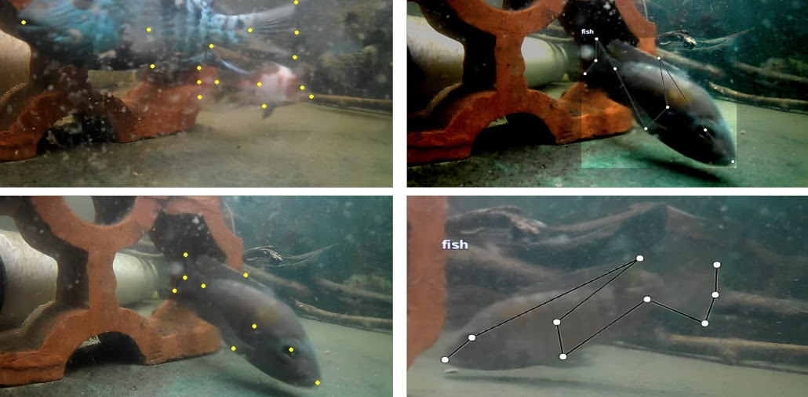

# Detection of Pond Fish 2024 Challenge


DePondFi'24 focuses on detecting fish key points from real-time underwater images to aid intelligent aquaculture systems in fish identification and biomass estimation. This challenge aims to develop robust computer vision algorithms to address the complexities of underwater environments, such as varying lighting, turbidity, and fish occlusions. The initiative supports Sustainable Development Goal 14 by enhancing aquaculture monitoring efficiency, aiding in disease detection, feeding optimization, and overall aquaculture management.


## Sample Image with keypoints

<div align="center">
  
</div>


## Steps to Run the Project

#### Step 1: Clone the Repository and Install Requirements

First, clone the repository and navigate to the project folder. Then, install the required packages.

```bash
# Clone the repository
git clone https://github.com/dsabarinathan/DePondFi24.git

# Change to the project directory
cd DePondFi24-main

# Install the required packages
pip install -r requirements.txt
```
#### Step 2: Convert Text and Image Files into Numpy Files

Run the provided script to convert your text and image files into numpy files. Ensure that you have your text and image files in the appropriate directories.

```bash
python convert_annotation2npy.py --image_path "D:/train/images/" --keypoint_path "D:/train/keypoints/" 
```

#### Step 3: Call the Training Code Using the Converted Files

Once you have the numpy files, you can use them to train your model. Run the training script and provide the path to your numpy files.

```bash
python train.py --epochs 5 --learning_rate 0.0001 --batch_size 32 --data_path "D:/train/converted_files/transformed_images.npy" --label_path "D:/train/converted_files/transformed_coord.npy"
```
